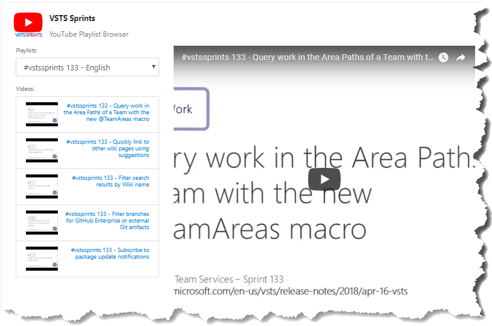
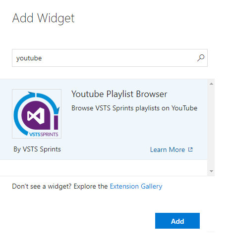

## Tutorial

The **VSTS Sprints Widgets** shows all videos of VSTS Sprints Channel within VSTS on your dashboards.

## Quick steps to get started ###

1. Create new Dashboard (suggested name "Video Features")

2. Edit your dashboard.

3. Select the **Youtube Playlist Browser** and click Add.
 

 
## Contributors
We thank the following contributor(s) for this extension: Gustavo Bergamin.

##Contribute
Contributions to VSTS Sprints Widget are welcome. Please fork this repo.

- Submit bugs and help us verify fixes.
- Submit pull requests for bug fixes and features and discuss existing proposals.
